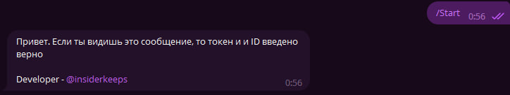

# Telegram-MailReader

`Telegram-MailReader` - **Этот проект представляет собой инструмент с открытым исходным кодом, который позволяет вам читать сообщения с вашей электронной почты через Telegram-бота. Он также предоставляет возможность настроить его функционал, чтобы соответствовать вашим потребностям. Продолжайте чтение, чтобы узнать, как правильно настроить и использовать этот бот.**

## Основные функции:

- Чтение сообщений с почты: Бот позволяет вам просматривать сообщения с вашей электронной почты напрямую через Telegram. Вы сможете видеть содержимое писем.

- Настройка через config.txt: Проект предоставляет гибкость в настройке. Вы можете легко изменять параметры бота через файл config.txt, который будет создан автоматически при первом запуске скрипта. Это означает, что вы имеете полный контроль над тем, как бот будет работать.

## Инструкции по установке:

1. Склонируйте этот репозиторий на свой компьютер.
2. Установите необходимые зависимости, если таковые имеются, согласно инструкциям в репозитории.
3. Запустите скрипт, чтобы создать файл config.txt.
4. Отредактируйте config.txt, заполнив следующие поля:

    - IMAP Host: Тип вашей почты (например, imap.gmail.com или imap.mail.ru).
    - IMAP User: Логин от вашей почты.
    - IMAP Pass: Пароль от вашей почты (не основной пароль, нужно создать "Пароль для приложений").
    - Bot Token: Токен вашего Telegram-бота (полученный у @BotFather).
    - Chat ID: Идентификатор вашего чата (полученный у @userinfobot).
    - В итоге вы получите это при старте бота

    

## Пример использования:

1. Запустите скрипт после настройки config.txt.
2. Напишите вашему боту в Telegram /Start.
3. Бот напишет про успешное подключение к API и покажет вам список писем.

## Дополнительная информация:

Этот проект предоставляет открытый исходный код, что подразумевает, что он доступен для общего просмотра, использования, модификации и распространения. Эта открытость способствует обеспечению прозрачности и будет способствовать дальнейшему развитию программы.

## Лицензия:

Этот проект лицензирован в соответствии с GNU General Public License (GPL)

## Для связи со мной вы можете воспользоваться:

- [Telegram](https://t.me/insiderkeeps) (Кликабельно)

